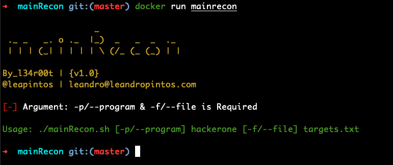
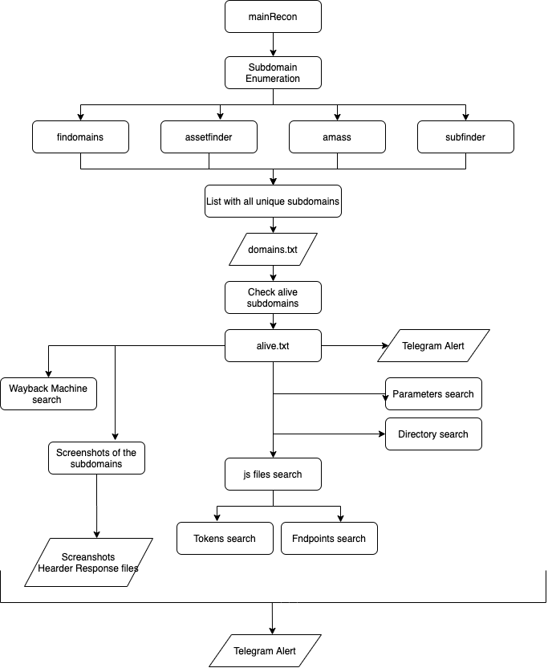
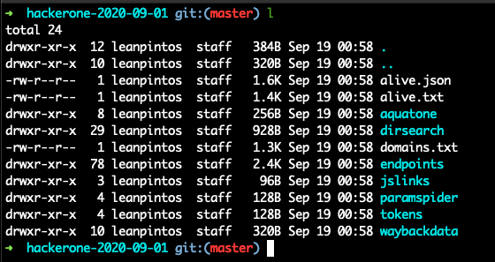
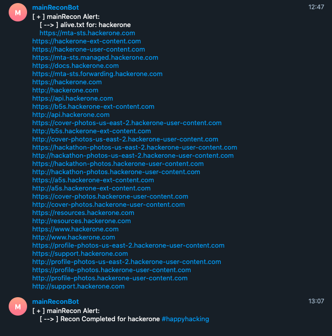

<br />
<p align="center">
  <a href="https://hub.docker.com/u/l34r00t">
    
  </a>

  <h3 align="center">mainRecon</h3>
</p>

<p align="center">
  <a href="https://github.com/l34r00t/"></a>
  <a href="https://github.com/l34r00t/"></a>
  <a href="https://github.com/l34r00t/"></a>
  <a href="https://github.com/l34r00t/"></a>
  <a href="https://hub.docker.com/r/l34r00t/mainrecon"></a>
  <a href="https://hub.docker.com/r/l34r00t/mainrecon"></a>
  <a href="https://hub.docker.com/r/l34r00t/mainrecon"></a>
  <a href="https://hub.docker.com/r/l34r00t/mainrecon"></a>
  <a href="https://hub.docker.com/r/l34r00t/mainrecon"></a>
  <a href="https://hub.docker.com/r/l34r00t/mainrecon"></a>

  mainRecon for bugbounty hunter is an image with a bash script with some of the tools used at recon workflow.
</p>

## Table of Contents

- [Table of Contents](#table-of-contents)
- [About mainRecon](#about-mainrecon)
- [Features](#features)
- [Flow](#flow)
- [mainRecon.sh](#mainreconsh)
- [Usage](#usage)
  - [Prerequisites](#prerequisites)
  - [Option 1 - Use the github repository](#option-1---use-the-github-repository)
  - [Option 2 - Use the image from docker hub](#option-2---use-the-image-from-docker-hub)
  - [Considerations to run the container](#considerations-to-run-the-container)
  - [targets.txt](#targetstxt)
  - [Create telegram webhook](#create-telegram-webhook)
- [mainRecon scan results](#mainrecon-scan-results)
  - [h1-Recon](#h1-recon)
  - [mainRecon Alert](#mainrecon-alert)
- [Environment tested](#environment-tested)
- [Coffee Time](#coffee-time)
- [Contributing](#contributing)
- [Stargazers over time](#stargazers-over-time)
- [Credits](#credits)
- [Disclaimer](#disclaimer)
- [License](#license)

## About mainRecon

mainRecon is an automated reconnaissance docker image for bug bounty hunter write in bash script. This image has the basic tools used in the recon workflow. The purpose is to simplify the recon workflow in a simple way.

You can run the docker image in your PC o [VPS](https://www.digitalocean.com/?refcode=b5a9fc36fd95&utm_campaign=Referral_Invite&utm_medium=Referral_Program).

## Features

- Subdomain Enumeration
- Checks alive subdomain
- Finds URLs at Wayback Machine
- Screenshots of the subdomains
- Headers responses files
- Finds js files
- Search tokes in js files
- Search endpoints in js files
- Finds parameters
- Finds directories
- Telegram notifications

## Flow
<p align="center">
  <a href="https://hub.docker.com/u/l34r00t">
    
  </a>
</p>

## mainRecon.sh

| **Name**          | **Repository**                                        |
| ----------------- | ----------------------------------------------------- |
| findomain         |  https://github.com/Edu4rdSHL/findomain               |                                     
| assetfinder       |  https://github.com/tomnomnom/assetfinder             |                                               
| Amass             |  https://github.com/OWASP/Amass                       |                                              
| subfinder         |  https://github.com/projectdiscovery/subfinder        |
| httprobe          |  https://github.com/tomnomnom/httprobe                |
| waybackurls       |  https://github.com/tomnomnom/waybackurls             |
| aquatone          |  https://github.com/michenriksen/aquatone             |
| subjs             |  https://github.com/lc/subjs                          |
| new-zile          |  https://github.com/bonino97/new-zile                 |    
| LinkFinder        |  https://github.com/GerbenJavado/LinkFinder           |
| paramspider       |  https://github.com/devanshbatham/ParamSpider         |
| gospider          |  https://github.com/jaeles-project/gospider         |
| dirsearch         |  https://github.com/maurosoria/dirsearch              |
| TelegramBot       |  https://core.telegram.org/bots                       |

## Usage
### Prerequisites

- [Docker](https://docs.docker.com/get-docker/) service installed

You can use the docker image by the next two options:

### Option 1 - Use the github repository

If you want to build the container yourself manually, git clone the repo, then build and run the following commands

    git clone --depth 1 https://github.com/l34r00t/mainRecon.git
    cd mainRecon

If you want Telegram Alert, you must modify the telegram bot_token and telegram chat_ID in mainRecon.sh

Also, you can configure access token for run findomain. You must configure the Dockerfile ("ENTER_TOKEN_HERE").

Build your docker container

**linux/amd64:**

```docker build -t mainrecon-master .```

**Others (including Apple silicon):**

```docker build --platform=linux/amd64 -t mainrecon .```

After building the container using either way, run the following:

**linux/amd64:**

```docker run --rm -it -v /path/to/local/directory:/mainData mainrecon -p [--program] <hackerone> [-f/--file] targets.txt [-e/--exclude] excludes.txt [OPTIONAL] -s [OPTIONAL]```

**Others (including Apple silicon):**

```docker run --platform linux/amd64 --rm -it -v /path/to/local/directory:/mainData mainrecon -p [--program] <hackerone> [-f/--file] targets.txt [-e/--exclude] excludes.txt [OPTIONAL] -s [OPTIONAL]```

### Option 2 - Use the image from docker hub

Use image from docker hub: [l34r00t/mainrecon](https://hub.docker.com/u/l34r00t/mainRecon)

    docker pull l34r00t/mainrecon
    docker run --rm -it --env chat_ID="your_chat_ID" --env token="your_token" \
    --env findomain_fb_token="fb_token" \
    --env findomain_spyse_token="spyse_token" \
    --env findomain_virustotal="virustotal_token" \
    --env findomain_securitytrails_token="securitytrails_token" \
    -v /path/to/local/directory:/mainData --name mainrecon l34r00t/mainrecon -p [--program] <hackerone> [-f/--file] targets.txt [-e/--exclude] excludes.txt [OPTIONAL] -s [OPTIONAL]

### Considerations to run the container

There are differents use cases for use the image and you should know how to run the container properly.

  Share information from your local directory to container directory and save information on your local directory. You should save information under /mainData directory.

**linux/amd64:**

```docker run --rm -it -v /path/to/local/directory:/mainData --name mainrecon l34r00t/mainrecon -p [--program] <hackerone> [-f/--file] targets.txt [-e/--exclude] excludes.txt [OPTIONAL] -s [OPTIONAL]```

**Others (including Apple silicon):**

```docker run --platform linux/amd64 --rm -it -v /path/to/local/directory:/mainData --name mainrecon l34r00t/mainrecon -p [--program] <hackerone> [-f/--file] targets.txt [-e/--exclude] excludes.txt [OPTIONAL] -s [OPTIONAL]```


### targets.txt

Your targets.txt should include a list of domains you're checking and should look something like:

        hackerone.com
        hackerone-ext-content.com
        hackerone-user-content.com

### excludes.txt

You can add any "out of scope" target to this file. You **don't must** use wildcard here, instead start the line with a . (dot) for subdomains. It should look something like:

        dev.hackerone.com # exclude dev.hackerone.com and subdomains
        .dev.hackerone.com # allow dev.hackerone.com but exclude it subdomains

### Strict mode

If you don't want to collect or scan subdomains, add the `-s` flag at the end of the command. It will skip the _get_subdomains_ functionalities, scanning only the explicit domains in targets.txt

### Create telegram webhook        

Thank you [Edu4rdSHL](https://github.com/Edu4rdSHL/) for you telegram webhook write-up.

- [create_telegram_webhook](https://github.com/Edu4rdSHL/findomain/blob/master/docs/create_telegram_webhook.md)

## mainRecon scan results

### h1-Recon

In the following repository you will obtain all [h1 recon results](https://github.com/l34r00t/mainRecon-h1-enum)



### mainRecon Alert



## Environment tested

The image was tested in the following environments:

- Docker service for Mac: Docker version 19.02.7, build afacb8b

- Docker service for Ubuntu 19.20 in [Digital Ocean VPS](https://www.digitalocean.com/?refcode=b5a9fc36fd95&utm_campaign=Referral_Invite&utm_medium=Referral_Program): Docker version 18.09.7, build build 2d0083d

## Coffee Time

If you like my content, please consider inviting me to a coffee. Thank you for your support!

[](https://www.buymeacoffee.com/l34r00t)

## Contributing

[Contributing](CONTRIBUTING.md)

## Stargazers over time

[](https://starchart.cc/l34r00t/mainRecon)

## Credits

mainRecon has been possible thank you to the following projects.

- [Edu4rdSHL](https://github.com/Edu4rdSHL)                                             
- [tomnomnom](https://github.com/tomnomnom/)         
- [OWASP](https://github.com/OWASP/)               
- [michenriksen](https://github.com/michenriksen/)
- [bonino97](https://github.com/bonino97/)
- [GerbenJavado](https://github.com/GerbenJavado/)
- [devanshbatham](https://github.com/devanshbatham/)
- [subjs](https://github.com/lc/subjs/)
- [maurosoria](https://github.com/maurosoria/)
- [Telegram BOT](https://core.telegram.org/bots)
- [LazyRecon](https://github.com/capt-meelo/LazyRecon)
- [SubEnum](https://github.com/bing0o/SubEnum)
- [aaaguirre](https://github.com/aaaguirrep/pentest)

## Disclaimer

- mainRecon was written for education purposes only.

## License

[MIT](LICENSE)
Copyright (c) 2020, L34r00t
